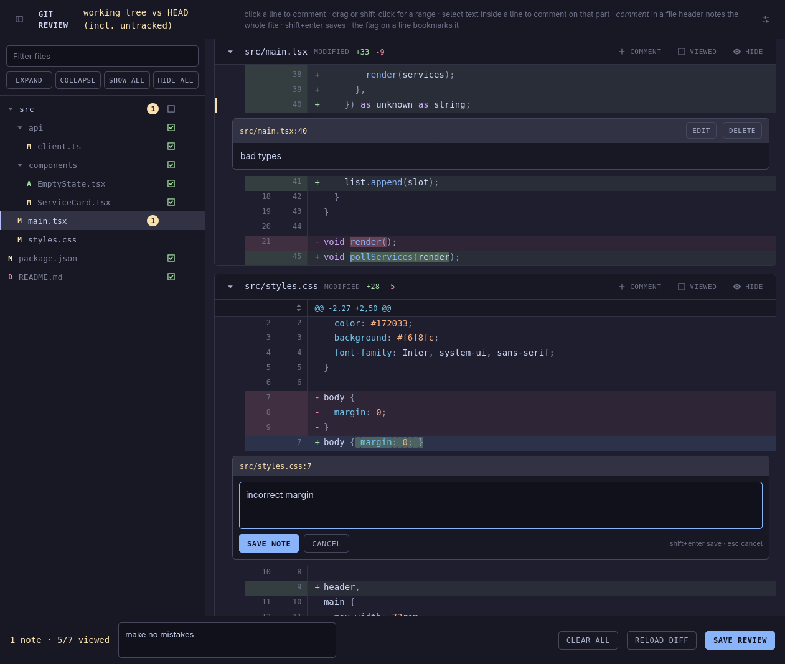

# Local Code Review

Small standalone web UI for reviewing local Git changes and writing feedback for coding agents.



## Install

Download the package for your system from the [latest release](https://github.com/cjvnjde/local-code-review/releases/latest), extract it, and put `lcr` (`lcr.exe` on Windows) somewhere on your `PATH`.

`lcr` only needs Git. macOS builds are unsigned, so a downloaded binary may need quarantine removed after you verify its release checksum:

```sh
xattr -d com.apple.quarantine ./lcr
```

## Use

Run inside any Git repository:

```sh
lcr
```

The review page opens at <http://localhost:7777>. It includes working-tree, staged, and untracked changes against `HEAD`. If that port is taken, `lcr` moves to the next free one (7778, 7779, ...) and prints the address it landed on.

Common commands:

```sh
lcr --no-open                 # Do not open the browser automatically
lcr --staged                  # Staged changes only
lcr HEAD~3                    # Last three commits
lcr main...HEAD               # Compare current branch with main
lcr --port 8080               # Start from another port
lcr --out .feedback           # Store reviews elsewhere
lcr --context 8               # Show more surrounding lines
```

Arguments not recognized by `lcr` are passed to `git diff`.

## How it works

1. Open `lcr` in a repository with changes.
2. Click a diff line, drag across lines, or select part of one line to add a note. A selected line narrows to
   part of itself as soon as you select inside it, selecting again re-picks that part, and clicking the line goes
   back to the whole line — a note you are still writing follows those re-picks and keeps what you typed. Hold
   alt (option) while dragging to select the code as plain text to copy, without opening a note. File-level notes
   and bookmarks are also available.
3. Use **Overall note** for anything about the review as a whole rather than about one place in it; add as many as you need. Then select **Save review**.
4. `lcr` writes `.review/review-<timestamp>.md`. The default `.review/` directory is ignored by Git.
5. Give that Markdown review to your coding agent.

When a change rewrites more than it keeps, **Settings → Removed lines** folds every run of deleted lines into one line you can click open again, so the diff reads as the file the change leaves behind. A run a note is attached to stays open, and jumping to a note or bookmark inside a fold opens it. That setting is only the default: **removed** in a file's own header folds or opens that one file, so you can read a single heavy rewrite as what it leaves behind and keep the rest of the diff as it was.

A simple agent prompt is enough:

```text
Address the newest lcr review in .review/.
```

The review contains file paths, line anchors, captured code, and note text, so the agent can still find the intended code after line numbers move.

### Then keep talking

The page stays on the diff after you save, and follows the agent while it works.

- The agent answers each note in the review file as it finishes it, and its reply appears under that note on the page. So does the diff it just changed.
- **Reply** under any note to answer back. Your message goes straight into the same file, where the agent picks it up.
- Your own replies stay yours: **Edit** on one rewords it where it stands, **Delete** takes it back out of the file. The agent's messages are read-only — they are its account of what it did.
- Notes stay attached as the code moves. When the change a note asked for removes the code it pointed at, the note is shown at the closest line left, or — when the file drops out of the diff entirely — at the end of the page, marked as unattached and still carrying the diff it was written against. You can keep replying to it either way.
- One file holds the whole conversation, and each conversation knows its diff: the file records the range, the branch, and the base commit it was opened against. Restarting `lcr` on the same diff picks that conversation back up; a different range, branch, or base starts a fresh one, and the earlier files stay on disk as history. **Settings → New review** starts fresh by hand.
- **Settings → Review file** lists every saved review — when it was opened, its branch and range, and how many notes are still open. **Open** reopens one as the live conversation, with its notes shown against the current diff.
- Notes from the branch's *other* reviews appear as dim markers on the lines they still match, so a remark made reviewing `main..HEAD` is not lost when you switch to reviewing the working tree. Hover the marker to read the note and its thread; **Continue in this review** carries it, history and all, into the review you are writing now.

The page refreshes the diff whenever nothing is being typed. With a note editor open it waits, and shows a `diff changed` pill in the header until you are done.

### Optional agent skill

This repository includes [`apply-lcr`](skills/apply-lcr/SKILL.md), a small skill that finds the newest review, works the notes one at a time, replies to each in the review file as it goes, runs project checks, and picks up any follow-ups you wrote while it worked.

Install it with the [Skills CLI](https://github.com/vercel-labs/skills), then ask your agent:

```sh
npx skills add cjvnjde/local-code-review --skill apply-lcr
```

```text
Apply the newest lcr review.
```

Or use `/apply-lcr` when your agent supports skill commands. Each note's `Status:` line — applied, answered, skipped, or needs input — shows on the note as soon as the agent writes it.

Reviews remain ordinary Markdown files. You can use them without the skill and with any coding agent.

## Develop

Development requires [Bun](https://bun.sh/) and Git.

Run from source:

```sh
bun ./src/index.ts --no-open
```

Run checks:

```sh
bun test ./src
bun build ./src/index.ts --target=bun --outdir /tmp/lcr-check
```

Build a standalone executable:

```sh
bun build ./src/index.ts --compile --minify --outfile lcr
```

The compiled executable contains the browser UI and needs only Git at runtime.
